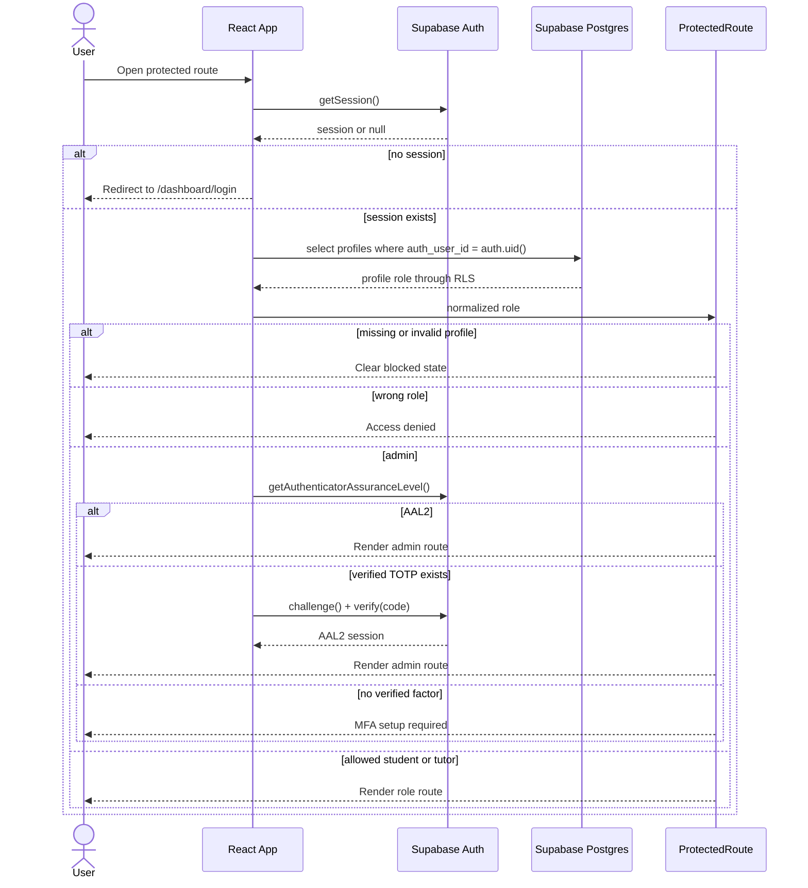
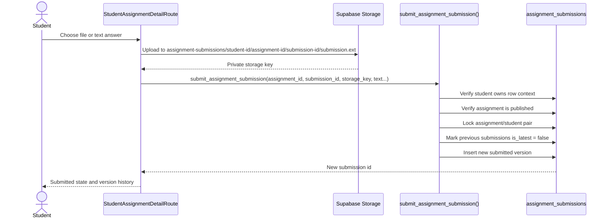
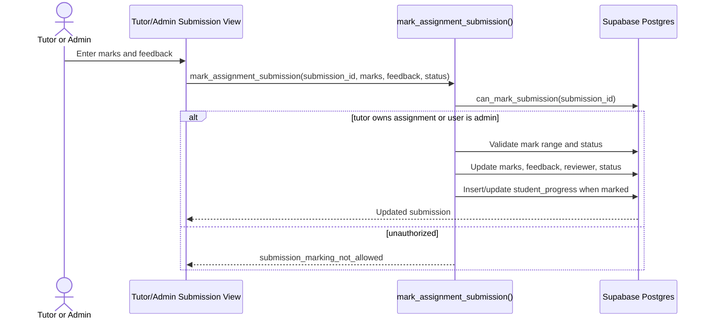

# Architecture

Project Odysseus / LJ's Tutoring is a Supabase-first tutoring platform for Grade 8-12 CAPS Mathematics operations in South Africa.

This document is the practical onboarding guide for new developers. If older docs or legacy code disagree with this document, follow this document and `docs/architecture/ADR-0001-supabase-first.md`.

## Current Verdict

- Active app: `src/` is the unified React, TypeScript, and Vite application for the public site, login, onboarding, student dashboard, tutor dashboard, and admin dashboard.
- Primary platform: Supabase Auth, `profiles`, RLS, Storage, and RPC are the browser trust boundary.
- Transitional backend: `lms-api/` still exists for Fastify services that need trusted server execution, but browser LMS access must not depend on Fastify cookie auth.
- Canonical Supabase schema source: `docs/supabase/schema.sql`. Local Supabase migrations are generated from that file.
- Legacy folders: `student-app/` and `legacy/static/` are inactive reference material unless a task explicitly says otherwise.

## Repository Map

| Path | Status | Purpose |
|---|---|---|
| `src/` | Active | Unified React frontend for public, auth, onboarding, student, tutor, and admin routes. |
| `src/app/App.tsx` | Active | Route registry for the unified React app. |
| `src/features/auth/` | Active | Supabase Auth state, role normalization, protected route guards, and admin MFA gate. |
| `src/features/assignments/` | Active | Supabase-first assignment reads and RPC-backed submission/marking mutations. |
| `src/features/students/` | Active | Student dashboard, assignments, results, careers, reports, and support routes. |
| `src/features/admin/` | Active | Admin dashboards and operational workflows. |
| `src/features/tutors/` | Active | Tutor dashboards, classes, sessions, submissions, reports, and risk views. |
| `src/lib/supabase/` | Active | Public Supabase browser client setup. |
| `src/lib/api/` | Transitional | API helper for backend-only services; forwards Supabase bearer auth where needed. |
| `docs/supabase/schema.sql` | Active source | Canonical Supabase tables, helper functions, RLS policies, Storage policies, and RPC functions. |
| `supabase/config.toml` | Active local setup | Supabase CLI local project configuration. |
| `supabase/migrations/` | Generated local target | Local migration output generated from `docs/supabase/schema.sql`; generated SQL is ignored by git. |
| `lms-api/` | Transitional/backend-specific | Fastify API for jobs, AI services, email, exports, legacy auth routes, and operational backend work. |
| `lms-api/prisma/migrations/` | Transitional legacy | Older/API migration path. Do not treat it as the source of truth for new Supabase-first browser data. |
| `scripts/build-static.js` | Active | Generates static HTML shells for React routes and copies public assets into `dist/`. |
| `assets/` | Active support assets | Static assets and runtime config files copied into the production static build. |
| `legacy/static/` | Legacy | Retired static portal source kept for audit/reference. |
| `student-app/` | Legacy | Older student app source; not the active student portal. |

## Active Frontend App

The production frontend is the Vite React app in `src/`.

Build and route-shell generation are split:

1. `npm run build:react` builds the React bundle into `react-app-dist/`.
2. `npm run build:static` runs `scripts/build-static.js`, copies assets, and creates `dist/**/index.html` shells for public and protected React routes.
3. `npm run inject:config` writes safe public runtime config into `dist/assets/portal-config.js`.
4. `npm run verify:static-assets` checks required release assets.

The root `npm run build` runs those steps together.

## Route Structure

Routes are registered in `src/app/App.tsx`.

| Route family | Access | Notes |
|---|---|---|
| `/`, `/about`, `/programs`, `/guides`, `/privacy`, `/terms` | Public | Marketing and informational pages. |
| `/login`, `/dashboard/login` | Public | Supabase Auth login surface. |
| `/onboarding/student`, `/onboarding/tutor` | Public entry, controlled writes | Self-service onboarding for non-admin roles only. |
| `/dashboard/student/*` | Student only | Dashboard, assignments, progress, results, careers, reports, community, settings. |
| `/dashboard/tutor/*` | Tutor only | Tutor dashboard, classes, sessions, submissions, reports, risk. |
| `/dashboard/admin/*` | Admin only + MFA | Admin dashboard, student/tutor management, assignments, approvals, payments, payroll, reconciliation, reports, results, audit, privacy, retention, ops runbook. |
| `/student/*`, `/tutor/*`, `/admin/*` | Compatibility redirects | Redirect into canonical `/dashboard/...` routes. |

`src/features/auth/ProtectedRoute.tsx` enforces route roles. Admin routes additionally pass through `src/features/auth/AdminMfaGate.tsx`.

## Supabase-First Auth And Role Model

Supabase Auth is the source of truth for browser identity.

The frontend auth flow is:

1. `src/features/auth/AuthProvider.tsx` loads Supabase session state.
2. `src/features/auth/authService.ts` calls `supabase.auth.getSession()`.
3. The app reads the authenticated user's `profiles` row by `auth_user_id`.
4. `src/features/auth/roles.ts` normalizes role values to `student`, `tutor`, or `admin`.
5. `ProtectedRoute` blocks unauthenticated, missing-profile, invalid-role, and wrong-role users.
6. Admin users must satisfy Supabase MFA assurance before admin content renders.



### Role Rules

- `student`: may access student routes and student-owned data.
- `tutor`: may access tutor routes and tutor-owned workflows, especially assignments they created.
- `admin`: may access admin routes only after Supabase session, admin profile, and MFA.
- `parent` and `ngo_partner`: exist in the Supabase role enum for future scoped reporting, but active frontend dashboards are not implemented yet.

Admin profiles must be created by trusted operator or service-role process. Public onboarding must not create admin roles.

## Supabase Data Ownership

`docs/supabase/schema.sql` defines the current Supabase-first model:

- `profiles`: application identity and role mapping connected to Supabase Auth users.
- `students` and `tutors`: role-specific operational records.
- `subjects`, `assignments`, `assignment_submissions`, and `student_progress`: learning workflow data.
- `student_career_profiles`: student-owned careers context.
- finance, class, and enrolment tables for admin/tutor operations.
- helper functions such as `current_profile_role()`, `current_profile_id()`, `current_student_id()`, and `can_mark_submission()`.

RLS is enabled on the main browser-facing tables. Policies keep students scoped to their own records, tutors scoped to assigned/created work, and admins broadly authorized where operationally required.

## Direct Supabase Calls Vs RPC

Direct Supabase browser calls are acceptable only when RLS fully protects the operation and no privileged field can be changed.

Allowed direct-call examples:

- Reading the signed-in user's own `profiles` row.
- Reading dashboard data where RLS scopes the row set.
- Student-owned upsert of low-risk self-service records such as career profile context.
- Uploading files to private Storage paths when the path is scoped by user ID and assignment ID.

Sensitive operations must use RPC or trusted backend code:

- assignment submission versioning,
- status changes,
- marking and feedback,
- result/progress release,
- role management,
- admin profile creation,
- tutor assignment ownership changes,
- payment, payroll, and reconciliation writes,
- privacy request processing,
- parent/NGO reporting exports,
- any mutation involving minors' private records where the browser should not choose the final authorization state.

## Assignment Submission Security

Student assignment submission is Supabase-first but not a raw table update.



Important rules:

- Students submit only for themselves.
- Submission files must use the scoped path shape enforced in SQL and Storage policies.
- Students cannot directly update `marks_awarded`, `feedback`, reviewer fields, release fields, status, or `is_latest`.
- Version numbers and latest-submission state are database-owned, not browser-owned.
- Closed or archived assignments are rejected by the RPC.

## Tutor/Admin Marking And Release Security

Marking is also RPC-owned.



Important rules:

- Tutors can mark only submissions for assignments they created.
- Admins can manage submissions according to admin policies.
- Progress rows created from marks are inserted inside the marking RPC.
- Direct tutor/student update policies for marking-sensitive fields are disabled.

## Supabase Storage

Current private buckets:

- `assignment-files`: assignment briefs/resources uploaded by admins or tutors.
- `assignment-submissions`: student submission files.

Storage policies in `docs/supabase/schema.sql` keep buckets private and scope access:

- Admins and tutors can upload assignment files.
- Authenticated users can read assignment files.
- Students can upload/update/delete only their own submission files in the required path shape.
- Students can read their own submissions.
- Tutors can read submission files only for assignments they created.
- Admins can read submission files.

## Fastify API Status

`lms-api/` is transitional and feature-specific, not the browser auth authority.

Current Fastify responsibilities include:

- health, readiness, metrics, request logging, CORS, CSRF, and operational middleware,
- legacy Google OAuth and cookie auth routes,
- admin/tutor/academic routes from the older API model,
- assistant and Odie careers services,
- email, jobs, reports, exports, and integrations where trusted backend execution is needed.

Rules for future backend work:

- Do not introduce a second browser session authority.
- Browser-protected routes should use Supabase session/profile state.
- Backend endpoints called by the browser should accept Supabase bearer identity or use service-role authority for backend-only tasks.
- Keep legacy cookie auth isolated until it can be removed or migrated.

## Migration Strategy

Supabase is now the direction for primary product data, auth, authorization, Storage, and privileged mutations.

- Edit `docs/supabase/schema.sql` for Supabase schema, RLS, Storage policies, and RPC.
- Run `npm run supabase:migration:sync` to generate the local Supabase CLI migration.
- Run `npm run supabase:reset` to apply the generated migration to local Supabase.
- Use `npm run test:rls` for source-level RLS/RPC contract coverage.

`lms-api/prisma/migrations/` remains for legacy/transitional API database work. Do not add new browser-domain LMS schema there unless the feature explicitly remains Fastify-owned.

## Local Development

Install dependencies:

```bash
npm install
npm install --prefix lms-api
```

Create local environment:

```bash
cp .env.example .env.local
```

Start local Supabase and copy local anon values:

```bash
npm run supabase:start
npm run supabase:status
```

Apply Supabase schema/RLS/RPC locally:

```bash
npm run supabase:reset
```

Run the active React app:

```bash
npm run dev:react
```

Build and verify frontend:

```bash
npm run test:frontend:unit
npm run test:rls
npm run typecheck:react
npm run build:react
```

Run the transitional API separately when needed:

```bash
npm run dev:api
npm run test:api
```

Full static production build:

```bash
npm run build
npm run serve
```

Local Supabase details live in `docs/supabase/LOCAL_DEVELOPMENT.md`.

## Deployment Notes

- Static React output is served from `dist/`.
- Protected static shells must include `noindex` metadata; `scripts/build-static.js` handles this for dashboard and onboarding routes.
- Browser-exposed config must contain only public values such as `VITE_SUPABASE_URL`, `VITE_SUPABASE_ANON_KEY`, and `PUBLIC_PO_API_BASE`.
- Never expose Supabase service-role keys to the browser.
- Production admin access requires Supabase MFA configuration and verified admin factors.
- Fastify deployment remains useful for backend services, but production browser auth is Supabase-first.
- Portal redirect env vars such as `ADMIN_PORTAL_URL`, `TUTOR_PORTAL_URL`, and `STUDENT_PORTAL_URL` should be origins only; route paths are appended by code.

## Security Notes

The platform handles minors, academic records, tutor information, parent/guardian context, and future NGO reporting. Treat this as sensitive education data.

- POPIA: collect the minimum learner data needed, keep access scoped, and document retention/deletion flows.
- Minors: do not expose classmate records, tutor notes, marks, contact data, or guardian data across learner accounts.
- RLS: every browser-facing table must have RLS enabled before production use.
- Roles: admin role assignment is trusted-operator/service-role only.
- MFA: admin routes require Supabase MFA in production.
- Storage: assignment files and submissions stay private; upload paths must include scoped IDs.
- RPC: sensitive writes belong in SQL functions that validate role, ownership, state, and allowed transitions.
- Tests: RLS/RPC policy tests should accompany every schema change that affects learner, tutor, admin, parent, or NGO data.

## Still Transitional Or Needs Clarification

- Parent and NGO dashboards are not active yet; future access should be modeled as scoped RLS views/RPC, not broad admin-like reads.
- Some Fastify API routes still use legacy cookie sessions and Prisma-era tables. They need endpoint-by-endpoint migration decisions.
- API migrations still exist for historical features. New Supabase-first LMS work should use the Supabase schema source unless a feature is explicitly backend-only.
- Admin onboarding/provisioning needs a trusted service-role workflow rather than public self-service.
