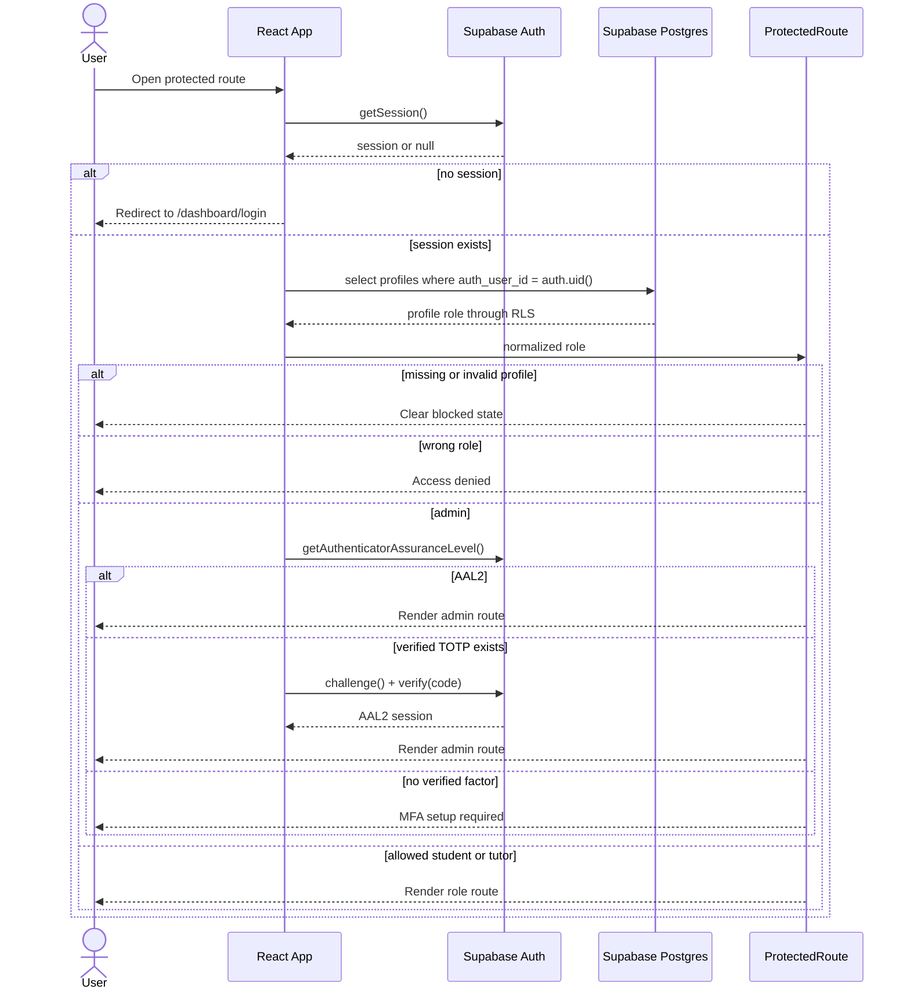
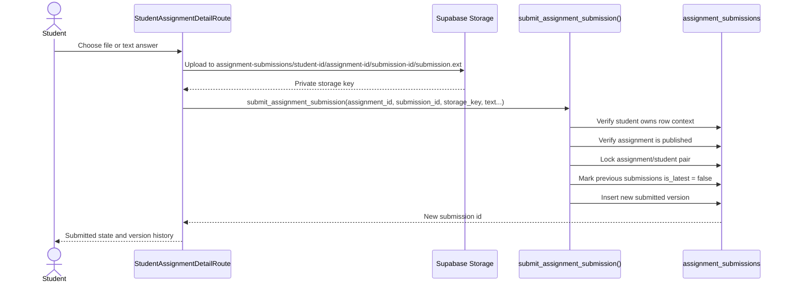
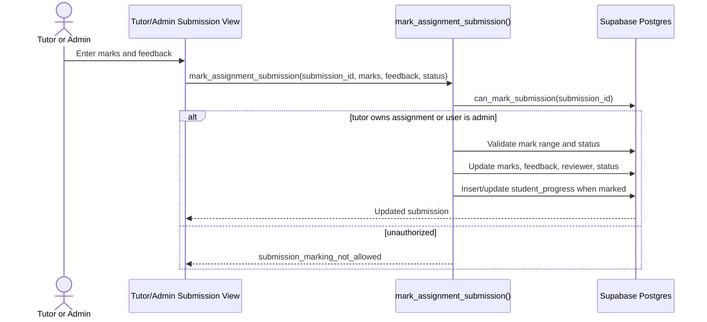

# Architecture

Project Odysseus / LJ's Tutoring is a Supabase-first tutoring platform for Grade 8-12 CAPS Mathematics operations in South Africa.

**Status:** current implementation and developer runbook, verified against the
2026-08-03 working tree. Record the deployed commit SHA in release evidence;
this document does not pretend an uncommitted verification has a release SHA.

This document is the practical source of truth for new developers. If an older
audit, migration plan, roadmap, or legacy folder disagrees with it, follow this
document. ADR-0001 and ADR-0003 record why the project chose this architecture;
they are decision history, not competing runbooks.

## Current Verdict

- Active app: `src/` is the unified React, TypeScript, and Vite application for the public site, login, onboarding, student dashboard, tutor dashboard, and admin dashboard.
- Primary platform: Supabase Auth, `profiles`, RLS, Storage, and RPC are the browser trust boundary — the **only** stack. `lms-api/` (Fastify + Prisma) was fully retired 2026-07-24; see [ADR-0003](ADR-0003-single-stack-supabase.md).
- Backend-only / trusted-execution work (Odie AI proxy, admin user invites) runs on Supabase Edge Functions (`supabase/functions/`), not a separate service.
- Desired-state / clean-install schema reference: `docs/supabase/schema.sql`.
- Immutable database delivery history: committed SQL under `supabase/migrations/`, applied in timestamp order by the Supabase CLI.
- Retired frontend sources: `student-app/`, `legacy/static/`, and the obsolete `assets/app-critical.js` were removed after the unified app reached parity. Their history remains available in Git; none is part of the active build.
- Static asset ownership: `assets/` is a closed six-file production allowlist. One untouched historical Community file remains under the owner's explicit Community exclusion and is never copied to `dist/`; see [STATIC_ASSET_OWNERSHIP.md](STATIC_ASSET_OWNERSHIP.md).

## Repository Map

| Path | Status | Purpose |
|---|---|---|
| `src/` | Active | Unified React frontend for public, auth, onboarding, student, tutor, and admin routes. |
| `src/app/App.tsx` | Active | Route registry for the unified React app. |
| `src/features/auth/` | Active | Supabase Auth state, role normalization, protected route guards, and admin MFA gate. |
| `src/features/assignments/` | Active | Supabase-first assignment reads and RPC-backed submission/marking mutations. |
| `src/features/students/` | Active | Student dashboard, assignments, results, careers, reports, and support routes. |
| `src/features/admin/` | Active | Admin dashboards and operational workflows. |
| `src/features/tutors/` | Active | Tutor dashboards, classes, sessions, submissions, reports, and risk views. |
| `src/features/parents/` | Active | Guardian-linked learner reports. |
| `src/features/ngo/` | Active | Aggregate NGO-partner reports. |
| `src/lib/supabase/` | Active | Public Supabase browser client setup, plus `edgeFunctions.ts` for streaming Edge Function calls. |
| `docs/supabase/schema.sql` | Active desired state | Canonical clean-install reference for Supabase tables, helper functions, RLS policies, Storage policies, and RPC functions. |
| `supabase/config.toml` | Active local setup | Supabase CLI local project configuration. |
| `supabase/functions/` | Active | Edge Functions for backend-only/trusted-execution work (Odie AI proxy, admin user invites). |
| `supabase/migrations/` | Active delivery history | Committed, immutable baseline and forward-only migrations replayed locally and in CI. |
| `scripts/build-static.js` | Active | Generates static HTML shells for React routes and copies public assets into `dist/`. |
| `assets/` | Closed allowlist | Six explicitly copied/build-consumed assets plus one non-production historical Community exclusion, inventoried in [STATIC_ASSET_OWNERSHIP.md](STATIC_ASSET_OWNERSHIP.md). |
| `student-app/`, `assets/app-critical.js` | Removed 2026-08-03 | Historical sources available through Git history; neither path participates in the active build. |

## Active Frontend App

The production frontend is the Vite React app in `src/`.

Build and route-shell generation are split:

1. `npm run build:react` builds the React bundle into `react-app-dist/`.
2. `npm run build:static` runs `scripts/build-static.js`, copies assets, and creates `dist/**/index.html` shells for public and protected React routes.
3. `npm run inject:config` writes safe public runtime config into `dist/assets/portal-config.js`.
4. `npm run verify:static-assets` checks required release assets.

The root `npm run build` runs those steps together.

## Route Structure

Routes are registered in `src/app/App.tsx`.

| Route family | Access | Notes |
|---|---|---|
| `/`, `/about`, `/programs`, `/guides`, `/privacy`, `/terms` | Public | Marketing and informational pages. |
| `/login`, `/dashboard/login` | Public | Supabase Auth login surface. |
| `/onboarding/student`, `/onboarding/tutor` | Public entry, controlled writes | Self-service onboarding for non-admin roles only. |
| `/dashboard/student/*` | Student only | Dashboard, assignments, progress, results, careers, reports, community, settings. |
| `/dashboard/tutor/*` | Tutor only | Tutor dashboard, classes, sessions, submissions, reports, risk. |
| `/dashboard/parent/*` | Parent only | Guardian-linked released learner reports. |
| `/dashboard/ngo/*` | NGO partner only | Permitted aggregate cohort reports. |
| `/dashboard/admin/*` | Admin only + MFA | Admin dashboard, student/tutor management, assignments, approvals, payments, payroll, reconciliation, reports, results, audit, privacy, retention, ops runbook. |
| `/student/*`, `/tutor/*`, `/admin/*` | Compatibility redirects | Redirect into canonical `/dashboard/...` routes. |

`src/features/auth/ProtectedRoute.tsx` enforces route roles. Admin routes additionally pass through `src/features/auth/AdminMfaGate.tsx`.

## Supabase-First Auth And Role Model

Supabase Auth is the source of truth for browser identity.

The frontend auth flow is:

1. `src/features/auth/AuthProvider.tsx` loads Supabase session state.
2. `src/features/auth/authService.ts` calls `supabase.auth.getSession()`.
3. The app reads the authenticated user's `profiles` row by `auth_user_id`.
4. `src/features/auth/roles.ts` normalizes role values to `student`, `tutor`,
   `admin`, `parent`, or `ngo_partner`.
5. `ProtectedRoute` blocks unauthenticated, missing-profile, invalid-role, and wrong-role users.
6. Admin users must satisfy Supabase MFA assurance before admin content renders.


```mermaid
sequenceDiagram
  actor User
  participant React as React App
  participant Auth as Supabase Auth
  participant DB as Supabase Postgres
  participant Guard as ProtectedRoute
  User->>React: Open protected route
  React->>Auth: getSession()
  Auth-->>React: session or null
  alt no session
    React-->>User: Redirect to /dashboard/login
  else session exists
    React->>DB: select profiles where auth_user_id = auth.uid()
    DB-->>React: profile role through RLS
    React->>Guard: normalized role
    alt missing or invalid profile
      Guard-->>User: Clear blocked state
    else wrong role
      Guard-->>User: Access denied
    else admin
      React->>Auth: getAuthenticatorAssuranceLevel()
      alt AAL2
        Guard-->>User: Render admin route
      else verified TOTP exists
        React->>Auth: challenge() + verify(code)
        Auth-->>React: AAL2 session
        Guard-->>User: Render admin route
      else no verified factor
        Guard-->>User: MFA setup required
      end
    else allowed student or tutor
      Guard-->>User: Render role route
    end
  end
```

### Role Rules

- `student`: may access student routes and student-owned data.
- `tutor`: may access tutor routes and tutor-owned workflows, especially assignments they created.
- `admin`: may access admin routes only after Supabase session, admin profile, and MFA.
- `parent`: may access only guardian-linked learner reports permitted by the database boundary.
- `ngo_partner`: may access only permitted cohort reporting data.

Admin profiles must be created by trusted operator or service-role process. Public onboarding must not create admin roles.

## Supabase Data Ownership

`docs/supabase/schema.sql` defines the current Supabase-first model:

- `profiles`: application identity and role mapping connected to Supabase Auth users.
- `students` and `tutors`: role-specific operational records.
- `subjects`, `assignments`, `assignment_submissions`, and `student_progress`: learning workflow data.
- `student_career_profiles`: student-owned careers context.
- finance, class, and enrolment tables for admin/tutor operations.
- helper functions such as `current_profile_role()`, `current_profile_id()`, `current_student_id()`, and `can_mark_submission()`.

RLS is enabled on the main browser-facing tables. Policies keep students scoped to their own records, tutors scoped to assigned/created work, and admins broadly authorized where operationally required.

## Direct Supabase Calls Vs RPC

Direct Supabase browser calls are acceptable only when RLS fully protects the operation and no privileged field can be changed.

Allowed direct-call examples:

- Reading the signed-in user's own `profiles` row.
- Reading dashboard data where RLS scopes the row set.
- Student-owned upsert of low-risk self-service records such as career profile context.
- Uploading files to private Storage paths when the path is scoped by user ID and assignment ID.

Sensitive operations must use RPC or trusted backend code:

- assignment submission versioning,
- status changes,
- marking and feedback,
- result/progress release,
- role management,
- admin profile creation,
- tutor assignment ownership changes,
- payment, payroll, and reconciliation writes,
- privacy request processing,
- parent/NGO reporting exports,
- any mutation involving minors' private records where the browser should not choose the final authorization state.

## Assignment Submission Security

Student assignment submission is Supabase-first but not a raw table update.


```mermaid
sequenceDiagram
  actor Student
  participant UI as StudentAssignmentDetailRoute
  participant Storage as Supabase Storage
  participant RPC as submit_assignment_submission()
  participant DB as assignment_submissions
  Student->>UI: Choose file or text answer
  UI->>Storage: Upload to assignment-submissions/student-id/assignment-id/submission-id/submission.ext
  Storage-->>UI: Private storage key
  UI->>RPC: submit_assignment_submission(assignment_id, submission_id, storage_key, text...)
  RPC->>DB: Verify student owns row context
  RPC->>DB: Verify assignment is published
  RPC->>DB: Lock assignment/student pair
  RPC->>DB: Mark previous submissions is_latest = false
  RPC->>DB: Insert new submitted version
  DB-->>UI: New submission id
  UI-->>Student: Submitted state and version history
```

Important rules:

- Students submit only for themselves.
- Submission files must use the scoped path shape enforced in SQL and Storage policies.
- Students cannot directly update `marks_awarded`, `feedback`, reviewer fields, release fields, status, or `is_latest`.
- Version numbers and latest-submission state are database-owned, not browser-owned.
- Closed or archived assignments are rejected by the RPC.

## Tutor/Admin Marking And Release Security

Marking is also RPC-owned.


```mermaid
sequenceDiagram
  actor Marker as Tutor or Admin
  participant UI as Tutor/Admin Submission View
  participant RPC as mark_assignment_submission()
  participant DB as Supabase Postgres
  Marker->>UI: Enter marks and feedback
  UI->>RPC: mark_assignment_submission(submission_id, marks, feedback, status)
  RPC->>DB: can_mark_submission(submission_id)
  alt tutor owns assignment or user is admin
    RPC->>DB: Validate mark range and status
    RPC->>DB: Update marks, feedback, reviewer, status
    RPC->>DB: Insert/update student_progress when marked
    DB-->>UI: Updated submission
  else unauthorized
    RPC-->>UI: submission_marking_not_allowed
  end
```

Important rules:

- Tutors can mark only submissions for assignments they created.
- Admins can manage submissions according to admin policies.
- Progress rows created from marks are inserted inside the marking RPC.
- Direct tutor/student update policies for marking-sensitive fields are disabled.

## Supabase Storage

Current private buckets:

- `assignment-files`: assignment briefs/resources uploaded by admins or tutors.
- `assignment-submissions`: student submission files.

Storage policies in `docs/supabase/schema.sql` keep buckets private and scope access:

- Admins and tutors can upload assignment files.
- Authenticated users can read assignment files.
- Students can upload/update/delete only their own submission files in the required path shape.
- Students can read their own submissions.
- Tutors can read submission files only for assignments they created.
- Admins can read submission files.

## Backend-Only / Trusted-Execution Work

There is no second backend service. Work that genuinely can't run in the browser (holding a secret key, service-role operations) runs on **Supabase Edge Functions** (`supabase/functions/`):

- `admin-invite-user` — invites/creates a Supabase Auth user + provisions their `profiles`/`students`/`tutors` row, using the service-role key.
- `odie-careers-chat-stream` — the Odie careers-chat AI proxy, holding the Groq API key server-side.

Rules for future backend work:

- Do not introduce a second browser session authority — Supabase Auth is the only one.
- Browser-protected routes use Supabase session/profile state.
- Anything needing a secret key or service-role authority is an Edge Function, not client code.

## Migration Strategy

Supabase is the direction for primary product data, auth, authorization, Storage, and privileged mutations — and, as of 2026-07-24, the *only* stack (`lms-api`/Prisma fully retired, see [ADR-0003](ADR-0003-single-stack-supabase.md)).

The project uses imperative, committed migrations with a frozen baseline:

1. Update `docs/supabase/schema.sql` so the desired-state reference remains accurate.
2. Discover the installed CLI command with `npx supabase migration --help`, then create a descriptively named forward migration with `npx supabase migration new <description>`.
3. Put only the forward delta in the new file. Never edit an already-applied migration.
4. Run `npm run supabase:reset` to rebuild local Postgres from the committed migration chain.
5. Run `npm run test:rls` for source contracts and `npm run test:rls:runtime` for the pgTAP allow/deny matrix against real PostgreSQL sessions.
6. Commit the desired-state schema and forward migration together.

`npm run supabase:legacy-baseline:overwrite` exists only to reproduce the
historical baseline from the desired-state file. It is not part of normal
development or CI.

## Local Development

Install dependencies:

```bash
npm install
```

Create local environment:

```bash
cp .env.example .env.local
```

Start local Supabase and copy local anon values:

```bash
npm run supabase:start
npm run supabase:status
```

Apply Supabase schema/RLS/RPC locally:

```bash
npm run supabase:reset
```

Run the active React app:

```bash
npm run dev:react
```

Build and verify frontend:

```bash
npm test
npm run test:rls
npm run test:rls:runtime
npm run lint
npm run typecheck:react
npm run build
npm run test:e2e
```

Full static production build:

```bash
npm run build
npm run serve
```

Local Supabase details live in `docs/supabase/LOCAL_DEVELOPMENT.md`.

## Deployment Notes

- Static React output is served from `dist/`.
- Protected static shells must include `noindex` metadata; `scripts/build-static.js` handles this for dashboard and onboarding routes.
- Browser-exposed config must contain only public values such as `VITE_SUPABASE_URL` and `VITE_SUPABASE_ANON_KEY`.
- Never expose Supabase service-role keys to the browser.
- Production admin access requires Supabase MFA configuration and verified admin factors.
- Scheduled uptime monitoring validates the static JSON contract, Supabase Auth health, and a zero-row PostgREST request using only the public URL and anon key.

## Security Notes

The platform handles minors, academic records, tutor information, parent/guardian context, and future NGO reporting. Treat this as sensitive education data.

- POPIA: collect the minimum learner data needed, keep access scoped, and document retention/deletion flows.
- Minors: do not expose classmate records, tutor notes, marks, contact data, or guardian data across learner accounts.
- RLS: every browser-facing table must have RLS enabled before production use.
- Roles: admin role assignment is trusted-operator/service-role only.
- MFA: admin routes require Supabase MFA in production.
- Storage: assignment files and submissions stay private; upload paths must include scoped IDs.
- RPC: sensitive writes belong in SQL functions that validate role, ownership, state, and allowed transitions.
- Tests: RLS/RPC policy tests should accompany every schema change that affects learner, tutor, admin, parent, or NGO data.

## Known Gaps And Release Boundaries

- The committed migration chain and pgTAP matrix are the database delivery gate; source-string RLS tests remain useful but are not runtime proof by themselves.
- Community is not release-approved. Its safeguarding and tenant-isolation work remains explicitly deferred by the project owner and must be completed before real-user enablement.
- Browser smoke journeys use a deterministic in-memory adapter. They test routes and UI behavior, not Supabase authorization; the pgTAP job is the database authorization gate.
- Production database changes must flow through reviewed migrations. Never use a local or linked reset against production, and never put production learner data in seed files.
