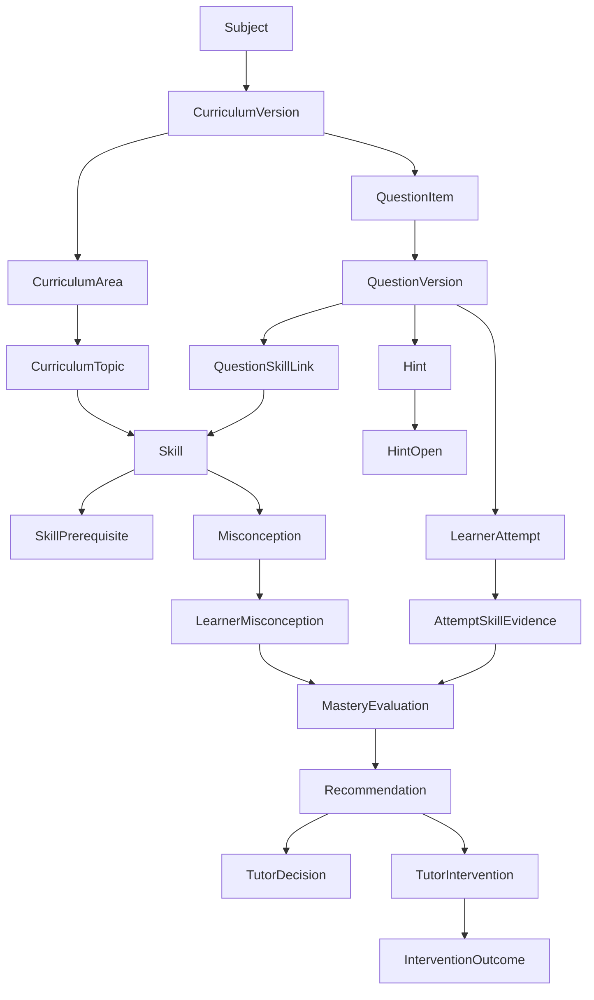

# Grade 9 Evidence-Driven Learning System

The implemented instructional vertical, composed activity, diagnostic routing
and content-review boundary are documented in
[Grade 9 Instructional Pilot](GRADE9_INSTRUCTIONAL_PILOT.md).
The validation workflow, human-review checklist and synthetic regression matrix
are documented in [Grade 9 Instructional Validation](GRADE9_INSTRUCTIONAL_VALIDATION.md).

## Scope and audit

This pilot covers Grade 9 CAPS Mathematics: Algebraic Expressions, Algebraic Equations, and Linear Graphs. It builds on—not over—the existing Supabase model:

- `subjects` remains the subject identity; `curriculum_versions` adds explicit CAPS/grade validity.
- `students`, `tutors`, `tutor_student_allocations`, and `sessions` provide the learner/tutor/access context.
- `assignments`, `assignment_submissions`, released rubric marks, and `competency_evidence` remain the formal-assessment workflow.
- `audit_log` is reused for curriculum, review, mastery, recommendation, and intervention change events.

The pre-existing `competency_evidence` table is useful released, rubric-level evidence, but is not an item bank, skill graph, misconception taxonomy, or mastery state. The existing content-authoring document describes `concepts` and `content_items`, but they were not present in the executable schema, so the pilot does not depend on documentation-only tables.

No safeguarding/risk table is joined, read, or scored by this domain. Safeguarding remains a restricted, separate operational domain and never influences mastery or placement.

## Domain model

Skill codes are stable canonical `curriculum_skills.skill_code` values, for example `G9.ALG.FACTOR.DOTS`, `G9.EQN.ZERO_PRODUCT`, and `G9.GRAPH.GRADIENT`. Grade 9-specific version, topic, term and ordering metadata belongs in `grade9_skill_metadata`; learning evidence and the prerequisite graph reference `curriculum_skills.id`. The prerequisite graph is the existing `skill_prerequisites` table, whose canonical constraints prevent self-links and invalid graph edges.

`question_items` is the stable item identity. `question_versions` is the immutable, answer-key-bearing revision. Once approved, its instructional fields cannot be changed; a material correction needs a new version. Pilot question seeds are drafts, therefore not learner-facing, until an administrator performs human review. Grade 9 recommendation records use `grade9_learning_recommendations` so the richer pilot contract does not collide with the foundation recommendation table.

## Evidence and mastery

`learning_attempts` records response, timestamp, confidence, time-on-task, context, and evaluation separately. `learning_attempt_hint_events` retains every opened hint and its order. When a tutor evaluates an attempt, `learning_attempt_skill_evidence` records whether the result was independent or assisted. Time and confidence are diagnostic context only; neither is translated into mastery points.

The pure decision service is [learningDecisionEngine.ts](../../src/features/learning/learningDecisionEngine.ts). Its pilot rule configuration is persisted and versioned in `mastery_rule_sets`:

- no independent evidence → `unassessed`;
- weak/inconsistent independent evidence → `emerging`;
- sufficient meaningful independent evidence → `developing`;
- strong independent target evidence across multiple occasions, with no unresolved configured critical misconception → `secure`;
- a later qualifying independent retrieval after a prior secure result → `retained`.

Every persisted result is an append-only `skill_mastery_evaluations` row, citing the exact evidence and misconception rows in `skill_mastery_evaluation_evidence`. It records state, rule-set id/version, reason, reason codes, timestamp, and decision actor. Nothing overwrites a prior state.

## Recommendations and interventions

`generateRecommendations` is also pure and deterministic. It evaluates transparent inputs such as repeated misconceptions, low complex-task accuracy, hint dependency, prerequisite state, and delayed-retrieval failure. The persisted recommendation cites a `recommendation_rule_sets` version and reason codes such as `REPEATED_MISCONCEPTION` or `LOW_COMPLEX_ACCURACY`.

Tutors retain professional agency through append-only `tutor_recommendation_decisions`: accept, modify, or reject records never erase the original recommendation. `tutor_interventions` records the delivered approach, structured observation, learner response, free-text notes, and follow-up; `intervention_outcomes` links immediate/delayed evidence and/or mastery reevaluation. This supports later analysis of intervention effectiveness by skill and misconception without reducing tutor notes to free text.

## Content review and authorization

Question review states are `draft`, `in_review`, `approved`, `rejected`, and `retired`. Source tiers include DBE, approved external, Odysseus-authored, and AI draft. There is no path from AI draft to learner delivery without review; in the current role model, only an MFA-qualified platform admin can approve or retire an item. Tutors can author drafts but cannot approve them.

RLS is enabled for every new public table. Students may read only their own attempts and mastery state; they cannot read question versions directly (which contain answer keys), misconceptions, internal recommendation reasoning, tutor notes, other learners, or any content-review workflow. A sanitized `get_learning_question` RPC exposes only approved prompts and hints. Attempt creation, hint events, marking, content review, mastery persistence, recommendation persistence, tutor overrides, and intervention/outcome recording use controlled RPCs. Tutor access is constrained through active `tutor_student_allocations`; admin curriculum actions remain admin-only.

## Formal versus formative assessment

`evidence_context` explicitly labels each item attempt `formative` or `formal_caps_assessment`. Formal assessment may add a cited evidence point, but `assignment_submissions`/percentages and `competency_evidence` do not become mastery state. Mastery is always an explainable evaluation under a versioned rule set.

## Operating flow

1. A reviewed item is delivered through the sanitized question RPC.
2. A learner response and any hint events are recorded.
3. A tutor evaluates the attempt; item-to-skill evidence records independent or assisted performance.
4. A tutor records misconception evidence where warranted.
5. The deterministic service evaluates a skill and an authorized service persists its explanation/history.
6. The deterministic recommendation service produces a rule-versioned recommendation.
7. A tutor decides and records intervention delivery.
8. Immediate and delayed follow-up evidence is linked as an intervention outcome, then mastery is reevaluated.

All high-value changes leave an `audit_log` event without copying raw learner response data into generic logs.
