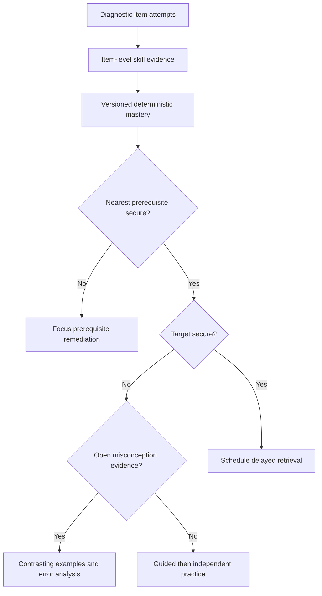

# Grade 9 Instructional Pilot

## Scope and audit adaptation

This pilot extends, rather than replaces, the evidence-learning foundation in
`20260826120612_grade9_evidence_learning_system.sql`. It uses existing
curriculum, skill, item-version, evidence, mastery, recommendation,
intervention and audit tables. The additive migration is
`20260826123020_grade9_instructional_pilot_vertical.sql`.

The foundation originally seeded several broad codes (for example
`G9.EQN.LINEAR`, `G9.GRAPH.DRAW_LINEAR`, and `G9.ALG.SUBSTITUTE`). The pilot
adds the finer canonical leaves requested for instruction, including
`G9.EQN.ONE_STEP`, `G9.EQN.MULTI_STEP`, `G9.GRAPH.LINEAR_DRAW`, and
`G9.ALG.SUBSTITUTION`. Superseded broad rows are soft-retired where there is a
semantic replacement; historical attempts continue to reference their original
skill ids. `G9.GRAPH.EQUATION_FROM_GRAPH` already had the required code and is
retained.

Skill names and descriptions are concise mappings, not quotations from DBE.
The existing curriculum source record remains the authority for the pilot's
CAPS/ATP alignment; no DBE wording is fabricated in seed content.

## Pilot content and review boundary

The migration seeds 52 Odysseus-authored item versions:

- 18 short diagnostic probes across expressions, equations and graphs;
- 18 Difference of Two Squares activity items; and
- 16 vertical-slice retrieval, representation, equation and graph items.

They cover retrieval, diagnostic, worked/faded examples, guided and
independent practice, error analysis, representation translation, interleaved
review, investigation and delayed retention. Items contain an internal memo,
deterministic `accepted_answers`, explicit primary skill, optional supporting
skills, cognitive level, representation, marks, expected misconception and,
where relevant, a five-level hint ladder.

All new authored content is seeded as `draft`. A migration cannot truthfully
assign the human reviewer required by the established approval model. An admin
must approve each item through `review_question_version` after mathematics
review; learners cannot read draft content or answer configuration. The new
`validate_question_version_for_approval` helper makes approval reject items
without an active curriculum, primary skill, memo, deterministic diagnostic
scoring, or a valid hint ladder.

## Diagnostic routing

`evaluateDiagnosticEvidence` in `learningDecisionEngine.ts` is pure and takes
one target-skill state plus an explicitly ordered prerequisite route. It does
not compute a learner ability number.

For example, an emerging brackets-equations target with emerging distributive
property routes to distributive remediation, not generic equation practice. An
emerging Difference of Two Squares target with secure prerequisites and open
DOTS misconception evidence routes to contrasting examples.

## Difference of Two Squares Foundations

`ACT.G9.ALG.FACTOR.DOTS.FOUNDATIONS` is a reusable activity template, not a
special-case screen. It has ten author-composable stages:

1. retrieval warm-up (perfect squares);
2. prerequisite check (expand conjugate binomials);
3. worked example;
4. faded example;
5. guided practice;
6. error analysis;
7. independent practice;
8. interleaved factorisation review;
9. exit check; and
10. delayed retrieval.

Each stage maps to immutable item versions. Hints are opened only on learner
request and are written as hint events. A correct answer after H4/H5 is assisted
success, not independent secure evidence.

## Recommendation priority

The initial deterministic priority in `generateRecommendations` is:

1. remediate the first ordered non-secure prerequisite when the target is not
   secure;
2. address repeated open misconception evidence using contrasting examples,
   faded practice, error analysis and retrieval;
3. offer a retrieval refresher after failed delayed retrieval;
4. scaffold complex-performance or hint-dependency gaps; and
5. schedule delayed retrieval for secure skills without a retrieval check.

Every result includes stored reason codes and may be accepted, modified or
rejected through the pre-existing tutor decision/intervention/outcome flow.
Time and confidence remain contextual evidence: neither changes mastery
numerically.

## Quality reporting

`get_grade9_learning_pilot_report()` is an admin-only, security-definer report
function. It returns diagnostic completion counts, mastery distribution,
misconception evidence, recommendation and tutor-decision counts, and
intervention immediate/delayed outcome counts. It supports later analysis while
keeping safeguarding entirely outside the academic domain.

## Current delivery limitation

There is intentionally no learner-facing diagnostic route until a designated
maths reviewer has approved the pilot items and diagnostic blueprint. This
avoids leaking answer keys or exposing unreviewed content. The next delivery
increment is a minimal approved-content-only learner runner that records
attempts through the existing controlled RPCs, followed by a tutor explanation
view.

The operational review workflow, synthetic validation matrix, approval-only
delivery boundary and validation limits are documented in
[Grade 9 Instructional Validation](GRADE9_INSTRUCTIONAL_VALIDATION.md).
